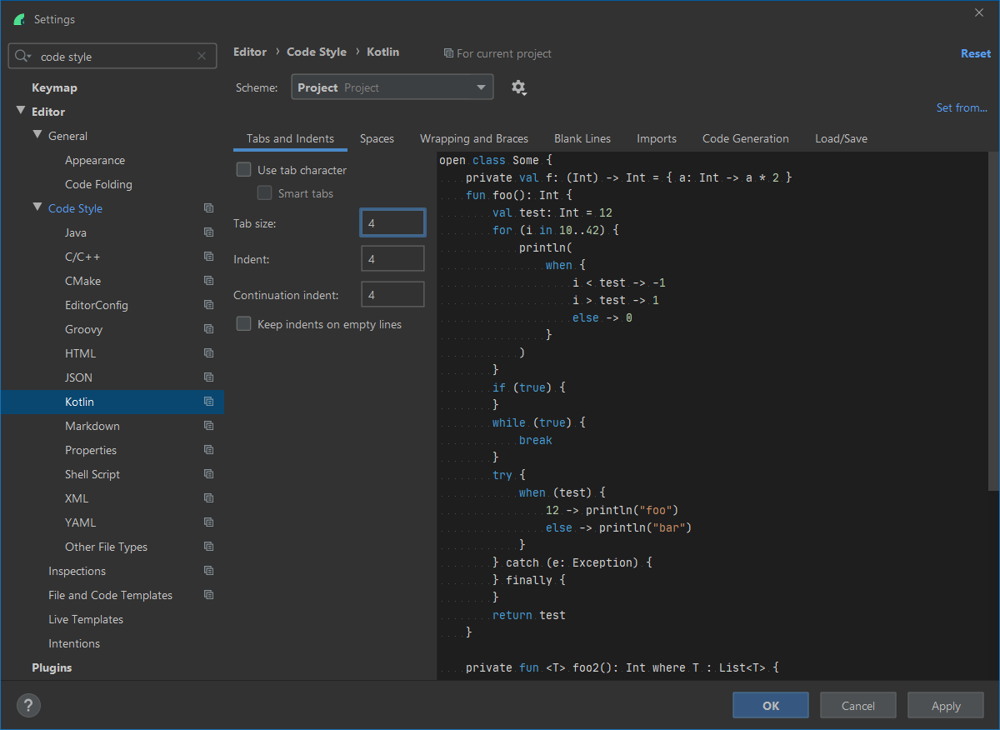
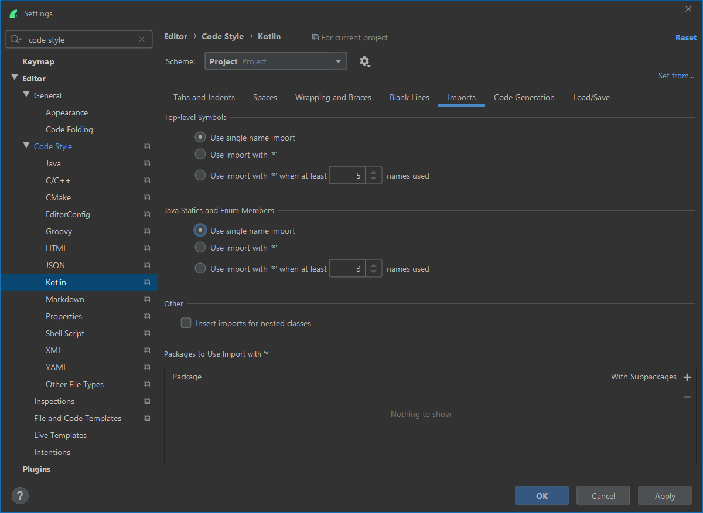
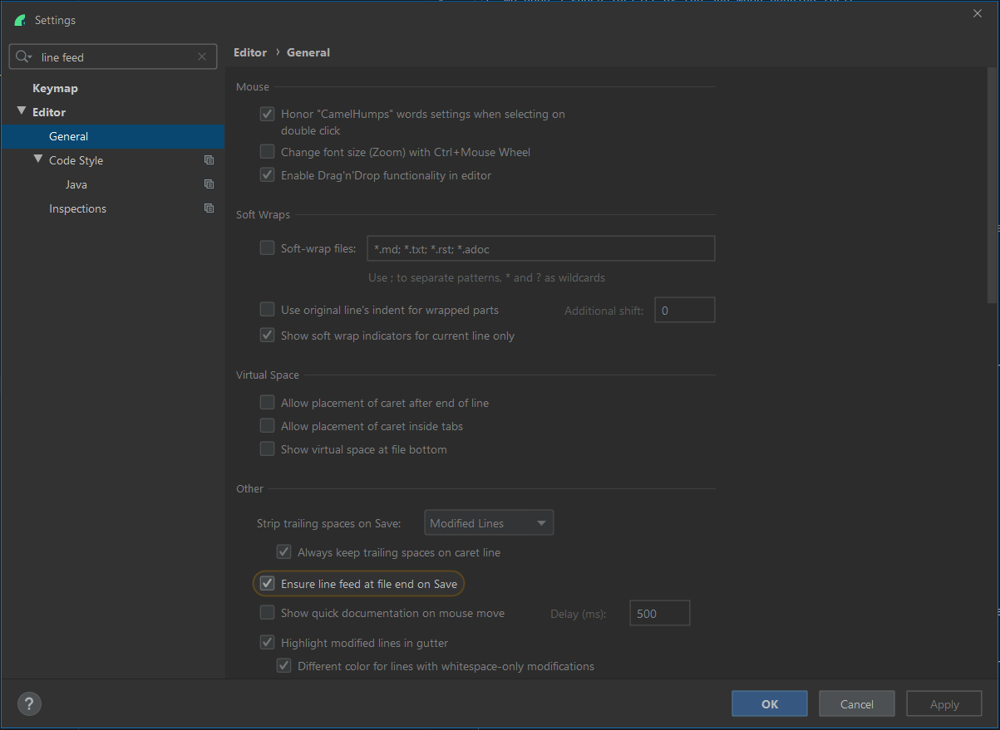

# Sonar Co-Locate for Android


## Build setup

Some secrets need to be set for the build to run. Please *DO NOT* add them to the project's `gradle.properties`.
Required secrets are:

 - `sonar.headerValue`
 - `sonar.analyticsKey`
 - `sonar.baseUrl`

To set a property refer to [official gradle documentation](https://docs.gradle.org/current/userguide/build_environment.html)

## Running tests

1. Device setup

    Make sure all animations are turned off on the device (not an emulator) that is running the tests.
    https://developer.android.com/training/testing/espresso/setup#set-up-environment
    
    Also ensure that location access is enabled on the device.

1. Before pushing code run -
    ```bash
    ./gradlew localBuild
    ```

   It is the default task, so you can also just run -
   ```bash
   ./gradlew
   ```

**NOTE**
 * PLEASE NEVER skip running the tests before pushing.
 * PLEASE NEVER disable tests.
 * PLEASE NEVER push code to master that knowingly breaks the test suite.

## PACT tests

[Pact contract tests](https://github.com/DiUS/pact-jvm) are run as part of the regular unit test suite. 
If one of the tests is failing, and you need more output, 
set slf4j logging to debug: `-Dorg.slf4j.simpleLogger.defaultLogLevel=DEBUG`

### Are your pact tests failing with "problem accessing trust store"?

This is a sign that you are registering encryption provider in a test but are not de-registering it after. Pact will then try to create a client using the Apache `SSLSocketFactory`. This will in turn try to use the encryption provider as the certificate trust store, resulting in the error you see. To fix, de-register the encryption provider after use in tests.

## Running tests on Firebase from your machine

Make sure your APKs are built -

```bash
./gradlew localBuild
```

You will need the [`gcloud` CLI](https://cloud.google.com/sdk/install).
Once installed run:

```$bash
./gradlew localBuild

gcloud init
gcloud config set project sonar-colocate
gcloud firebase test android run \
    --type=instrumentation \
    --app=app/build/outputs/apk/debug/app-debug.apk \
    --test=app/build/outputs/apk/androidTest/debug/app-debug-androidTest.apk \
    --device-ids=aljeter_n \
    --os-version-ids=26 \
    --use-orchestrator \
    --environment-variables=clearPackageData=true
```

## Code formatting with KTLint

KTLint has been added to the build and will automatically run when you run the build.
It is attached to the `check` step of the build.

The official Kotlin style guide recommends slightly different configuration from the default
Android Studio setup.

1. The continuation indent should be set to 4

    

1. Imports should *never* use wildcards

    

1. Files should end with a new line character.
    
    

## Play Store

1. Make sure you have configured the following properties in `~/.gradle/gradle.properties`

   ```properties
   SIGNING_KEY_ALIAS=<keystore alias>
   SIGNING_KEY_STORE=<path/to/keystore>
   SIGNING_KEY_STORE_PASSWORD=<keystore password>
   SIGNING_KEY_PASSWORD=<key password>
   PLAY_SERVICES_PUBLISH=<path/to/play-services.json>
   ```

1. Update the release notes in `app/src/main/play/release-notes/en-GB/default.txt`

1. To publish new release in `internal test track`, run following command in project root directory:

   ```bash
   ./gradlew publish -Pplay-enabled
   ```

1. To prompt a release from internal track to alpha (stakeholder) track, run following command in project root directory:

   ```bash
   ./gradlew promoteArtifact -Pplay-enabled
   ```

**NOTE**
  * The build number will be set automatically. you don't need to change or commit it to git

Check [Gradle Play Publisher](https://github.com/Triple-T/gradle-play-publisher) for more info
