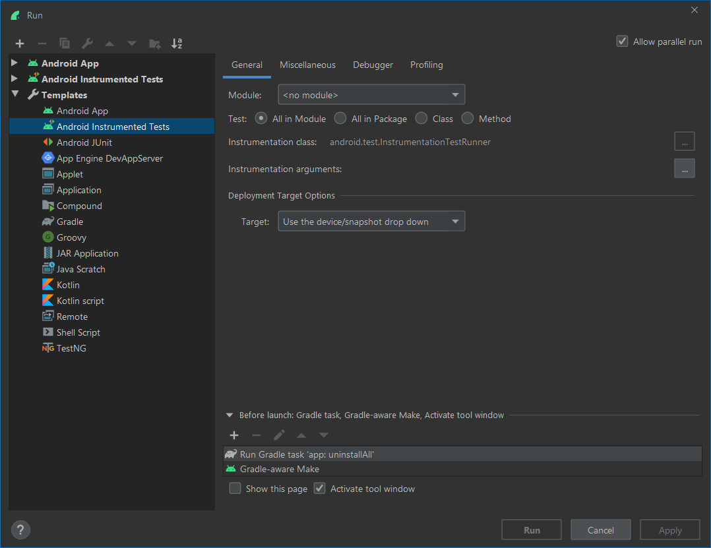

# Sonar Colocate for Android

## Running tests

1. We need a fresh install of the app when running tests
   so that we can correctly simulate acceptance of permissions.

    When running from the command line it's already taken care of
    with the following gradle configuration -
 
    ```groovy
    afterEvaluate {
        tasks["connectedAndroidTest"].dependsOn("uninstallAll")
        tasks["packageDebugAndroidTest"].mustRunAfter("uninstallAll")
    }
    ```
    
    In Android Studio make sure to configure `androidTest` tasks to run `uninstallAll`
    from gradle before running.
    
    

1. Device setup

    Make sure all animations are turned off on the device that is running the tests.
    https://developer.android.com/training/testing/espresso/setup#set-up-environment

1. Before pushing code run -
    ```bash
    ./gradlew build connectedAndroidTest
    ```

   They are the default tasks, so you can also just run -
   ```bash
   ./gradlew
   ```

## Code formatting with KTLint

KTLint has been added to the build and will automatically run when you run the build.
It is attached to the `check` step of the build.

The official Kotlin style guide recommends slightly different configuration from the default
Android Studio setup.

1. The continuation indent should be set to 4

    

1. Imports should *never* use wildcards

    

1. Files should end with a new line character.
    
    
